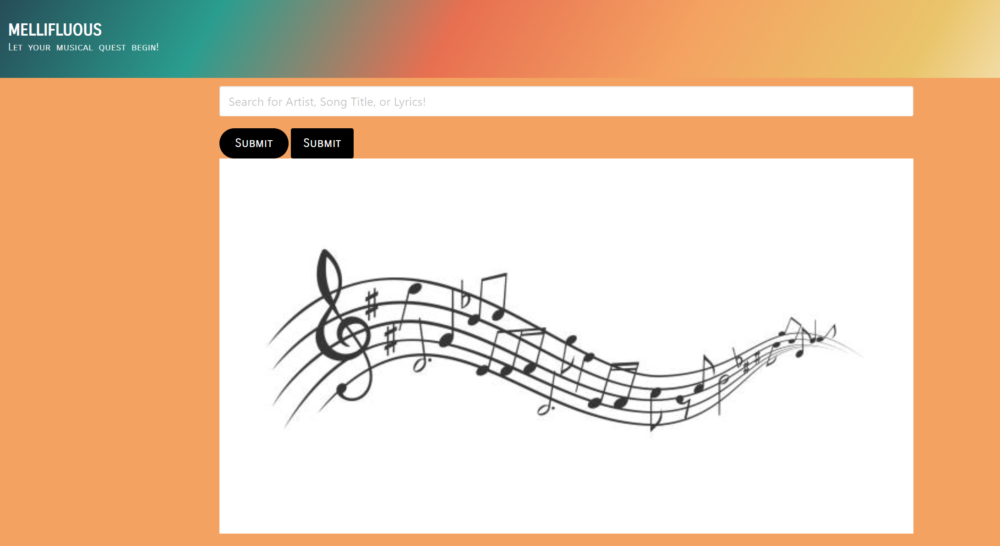

# Mellifluous

## Description
Creating a song search application. A browser website that will allow users to search for songs based off of lyrics, artists, or the song titles. After searching through either three options results based upon the users specific search will populate. 

## How to use
1. Type in the name of a song, the name of the artist or a string of lyrics from a song in the text box.
2. Navigate through the search results to find results based on your text parameters.
3. Click on desired result box to navigate to page which reveals lyrics to the song and a link to the artist profile.

## Website URL
https://eigenvalue000.github.io/project-01/

## Screenshots

## Tech/Framework
Built with:
    *HTML
    *CSS
    *JavaScript
    *Jquery
    *Giphy
    *Genius

## Authors and Acknowledgment
Skillfully created by members of the 2021 UC Davis Coding Bootcamp: Kelsey Duru, Garrett Kegel, Nikki Mounce, Nicholas Skinner and Karina Williams.

## Installation Instructions
1. Clone the github repo to your desktop:https://github.com/eigenvalue000/project-01.git
2. Navigate to the top level of your directory.
3. Open js/index.html in your browser.
## Known Bugs

## License
Copyright [2021] [##Authors]

Licensed under the Apache License, Version 2.0 (the "License");
you may not use this file except in compliance with the License.
You may obtain a copy of the License at

    http://www.apache.org/licenses/LICENSE-2.0

Unless required by applicable law or agreed to in writing, software
distributed under the License is distributed on an "AS IS" BASIS,
WITHOUT WARRANTIES OR CONDITIONS OF ANY KIND, either express or implied.
See the License for the specific language governing permissions and
limitations under the License.

